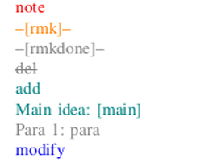

# ACM latex template

- Template for conference
- Compile two versions, writing and submission. In writing version, we defined a set of commands to mark changed text (see main.tex). 



- Original template in latex_template.zip, which can be downloaded from https://www.acm.org/publications/proceedings-template
- Local compile: make
- Overleaf: uncomment this line of code in main.tex to generate submission version while using overleaf

``` tex
 \newcommand{\submitmode}{true}
```

see https://github.com/AnissL93/IEEE_template for IEEE template
